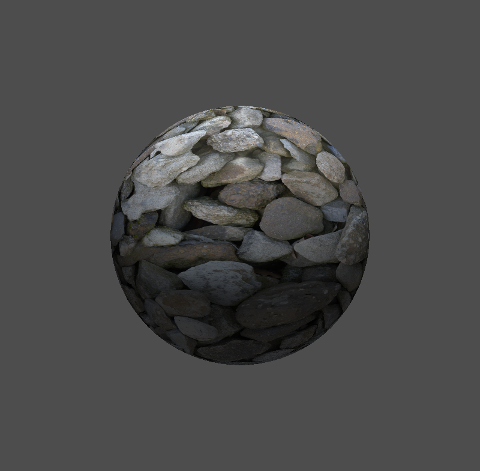
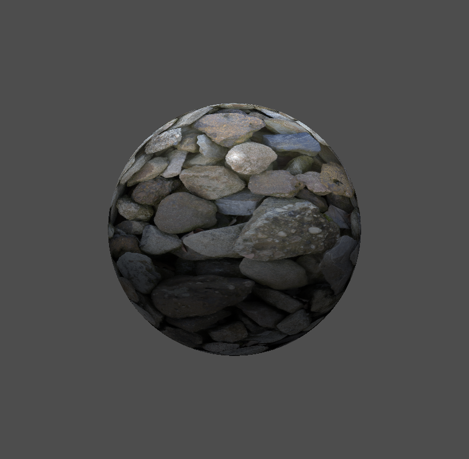
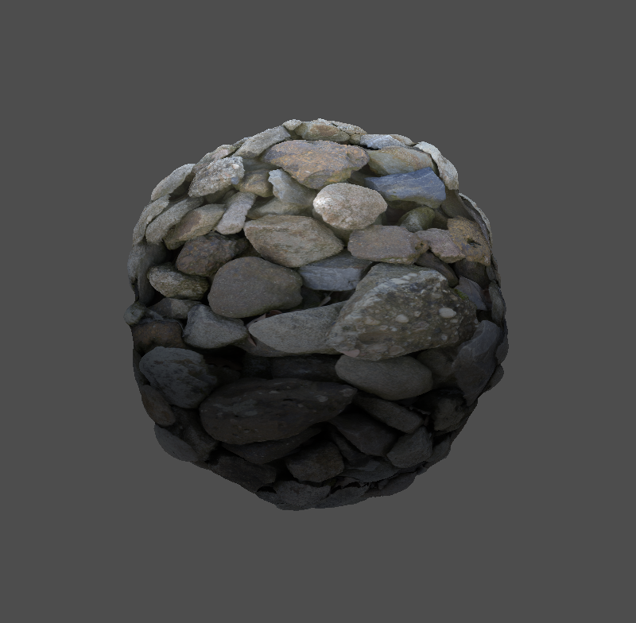
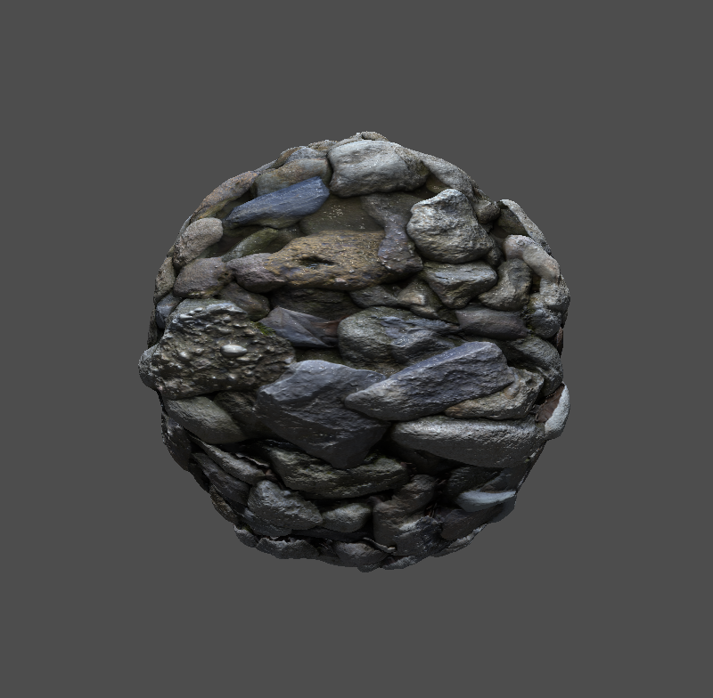

# 💡 GPGPU Rendering Techniques - Illumination – Materials

Projet académique réalisé à **CPE Lyon (5ETI – IMI 2024-2025)**.  
L’objectif est d’exploiter la puissance de la programmation **GPU** pour mettre en œuvre des techniques de rendu temps réel, en utilisant **OpenGL** et des **shaders GLSL**.

---

## ✨ Fonctionnalités implémentées

- **Illumination de Phong** : modèle d’éclairage classique avec composantes ambiante, diffuse et spéculaire.
  

- **Multi-textures & Occlusion ambiante (AO)** : enrichissement visuel grâce à la combinaison de cartes de matériaux.
  

- **Displacement mapping** : modification dynamique de la géométrie à partir d’une carte de hauteur.
  

- **Normal mapping (espace tangent)** : simulation de détails de surface sans augmenter le nombre de sommets.
  

---

## 🛠️ Stack technique

- **Langage** : C / C++  
- **API graphique** : OpenGL  
- **Shaders** : GLSL  
- **Pipeline** : Vertex Shader + Fragment Shader  
- **Outils** : GLFW, GLAD, stb_image  

---

## 🚀 Lancer le projet

```bash
# Cloner le repo
git clone https://github.com/MathieuZem/GPGPU-Rendering-Techniques.git
cd GPGPU-Rendering-Techniques

# Compiler et exécuter (exemple avec CMake)
mkdir build && cd build
cmake ..
make
./gpu_illumination
